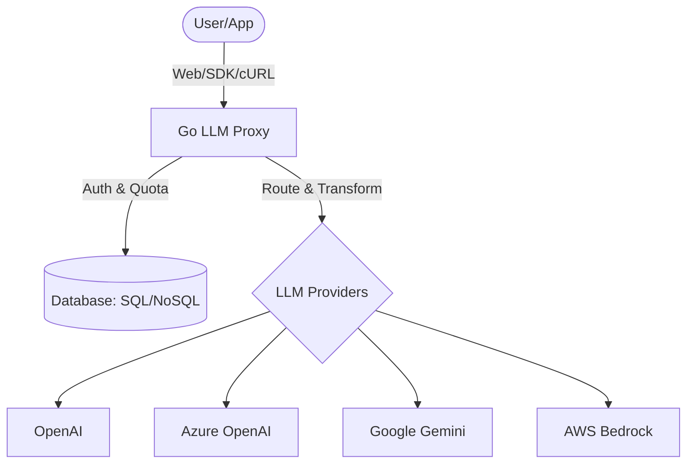

# 🚀 Go LLM Proxy Server

[](https://goreportcard.com/report/github.com/supakornemchananon/go-llm-proxy-server)
[](https://opensource.org/licenses/MIT)

A high-performance, enterprise-ready LLM proxy server written in Go. Unified access to OpenAI, Azure OpenAI, Google Gemini, and AWS Bedrock with advanced quota management and virtual key security.

---

## 🌟 Key Features

- **Unified API**: One endpoint to rule them all. Use OpenAI-compatible SDKs for any provider.
- **Provider Adapters**: 
  - **OpenAI**: Native support.
  - **Azure OpenAI**: Automatic path and header mapping.
  - **Google Gemini**: Support for AI Studio OpenAI-compatible endpoints & native SDKs.
  - **AWS Bedrock**: Claude 3/3.5 support with payload surgery.
- **Security First**: 
  - **Virtual Keys**: Never share your master API keys. Issue hashed virtual keys to teams.
  - **Master Key Bypass**: Admin access via `MASTER_KEY` environment variable.
- **Enterprise Controls**:
  - **Granular Rate Limiting**: Per-key, per-model Request-Per-Second (TPS) and Token quotas.
  - **Flexible Storage**: Supports SQLite (local), PostgreSQL (scalable), and MongoDB (NoSQL).
- **Modern Architecture**: Stateless design, Docker-ready, and CGO-optimized for SQLite performance.

## 🏗️ Architecture



## 🚀 Quick Start

### 1. Run with Docker Compose
```bash
docker compose up --build -d
```

### 2. Manual Setup
```bash
go build -o llm-proxy
export DATABASE_URL="sqlite.db"
export DB_TYPE="sqlite"
export MASTER_KEY="your-admin-bypass-key"
./llm-proxy serve
```

## 🛠️ CLI Guide

Managing your proxy is simple with the built-in CLI.

### Add a Connection
```bash
./llm-proxy connection add --name "prod-openai" --provider "openai" --endpoint "https://api.openai.com/v1" --api-key "sk-..."
```

### Add a Virtual Key (New!)
You can now auto-assign models during key creation:

**By Connection (Access everything in that provider):**
```bash
./llm-proxy vkey add --name "Dev-Team-1" --key "secret-dev-key" --conn-id "<CONN_ID>"
```

**By Model (Restrict to a specific model):**
```bash
./llm-proxy vkey add --name "Chatbot-App" --key "sk-chat-key" --model-id "<MODEL_ID>"
```

## 📚 Documentation

- [**Thai Guide (คู่มือภาษาไทย)**](docs/GUIDE_TH.md) - Full setup guide in Thai.
- [**Deployment Guide**](docs/DEPLOYMENT.md) - Cloud and Docker details.
- [**Sample Code**](docs/SAMPLES.md) - Python/JS usage examples.

## 📄 License
Released under the MIT License. Built with ❤️ for the LLM community.
