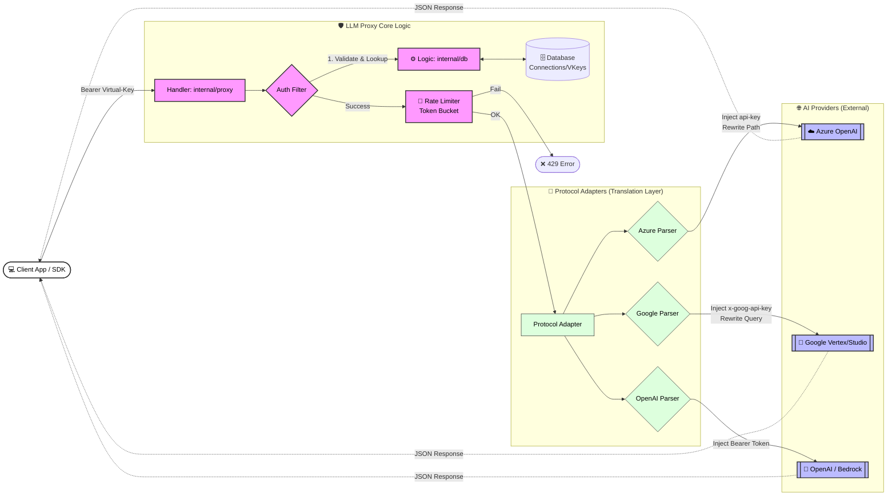

# คู่มือการใช้งานและโครงสร้างระบบ LLM Proxy Server (ฉบับละเอียด)

เอกสารนี้อธิบายสถาปัตยกรรมภายในของระบบ LLM Proxy Server พร้อมคำแนะนำวิธีการตั้งค่า Connection ไปยัง AI Provider เจ้าดังต่างๆ อย่างละเอียด

---

## 🏗 System Architecture (โครงสร้างระบบ)

แผนภาพด้านล่างแสดงการทำงานของระบบเมื่อ Client (เช่น Python Script, cURL) ส่ง Request เข้ามายัง Proxy:



### คำอธิบายส่วนประกอบหลัก (Components)
1.  **Proxy Handler (`internal/proxy`)**: ด่านหน้าสำหรับรับ HTTP Request ทำหน้าที่:
    -   แกะ `Authorization` Header เพื่อหา Virtual Key
    -   อ่าน Body หรือ URL Path เพื่อหาว่า User ต้องการเรียก Model อะไร (เช่น `gpt-4`, `gemini-1.5`)
2.  **Database (`internal/db`)**: เก็บข้อมูล 4 ส่วนหลัก:
    -   `Connections`: เก็บ Credential จริงของ Provider (เช่น OpenAI API Key) **(ถูกเข้ารหัสเก็บไว้)**
    -   `ProviderModels`: เก็บชื่อ Model จริงในระบบ Provider (เช่น `gemini-1.5-flash-001`)
    -   `VirtualKeys`: กุญแจที่ Proxy สร้างขึ้นแจกจ่ายให้ Client
    -   `Assignments`: ตารางจับคู่ว่า Virtual Key นี้ มีสิทธิ์ใช้ Model ไหนได้บ้าง
3.  **Rate Limiter (`internal/ratelimit`)**: คอยนับจำนวน Request และ Token ที่ถูกใช้ไปในแต่ละวินาที ถ้าเกินกำหนดจะตีกลับทันที
4.  **Protocol Adapter**: (สำคัญมาก) ทำหน้าที่แปลง Request ให้เข้ากับมาตรฐานของแต่ละค่าย เช่น:
    -   **Azure**: ต้องเติม `?api-version=...` และใช้ Header `api-key`
    -   **Google Vertex/Gemini**: ต้องสลับระหว่าง `x-goog-api-key` หรือ `Authorization: Bearer` ตามชนิดของ Key ที่ใช้

---

## 🛠 วิธีการสร้าง Connection ไปยัง Provider ต่างๆ

ก่อนเริ่มใช้งาน ต้องรัน Server ด้วยคำสั่ง:
```bash
# รันผ่าน Docker Compose
docker compose up -d

# หรือรัน Binary
./llm-proxy serve
```

### 1. OpenAI (Standard)
OpenAI เป็นมาตรฐานกลางที่ง่ายที่สุด

**ข้อมูลที่ต้องเตรียม:**
-   **API Key**: `sk-...`
-   **Endpoint**: `https://api.openai.com`

**คำสั่ง:**
```bash
# 1. สร้าง Connection
./llm-proxy connection add \
  --name "OpenAI-Main" \
  --provider "openai" \
  --endpoint "https://api.openai.com" \
  --api-key "sk-proj-YourKey..."

# (สมมติได้ ID: conn-123)

# 2. เพิ่ม Model เข้าไปใน Connection นี้
./llm-proxy model add \
  --conn-id "conn-123" \
  --name "gpt-4-turbo" \
  --remote "gpt-4-turbo-preview"
```

### 2. Azure OpenAI Service
Azure มีรูปแบบ URL ที่ซับซ้อนกว่า โดยมักจะอยู่ในรูป `https://{resource}.openai.azure.com/` หรือรูปแบบ Foundry

**ข้อมูลที่ต้องเตรียม:**
-   **API Key**: Key จาก Azure Portal
-   **Endpoint**: URL หน้าตาประมาณ `https://my-resource.openai.azure.com` หรือ Foundry URL

**คำสั่ง:**
```bash
# 1. สร้าง Connection
./llm-proxy connection add \
  --name "Azure-Corp" \
  --provider "azure" \
  --endpoint "https://my-company.openai.azure.com" \
  --api-key "your-azure-key"

# (สมมติได้ ID: conn-456)

# 2. เพิ่ม Model (Deployment Name สำคัญมากใน Azure)
./llm-proxy model add \
  --conn-id "conn-456" \
  --name "gpt-4o" \
  --remote "gpt-4o" \
  --deployment "deployment-name-in-azure"
```

> **Note:** Proxy จะเติม `?api-version=2024-05-01-preview` ให้เองอัตโนมัติหากไม่ได้ระบุมา

### 3. Google Gemini (AI Studio)
สำหรับผู้ใช้ Google AI Studio (API Key ปกติ)

**ข้อมูลที่ต้องเตรียม:**
-   **API Key**: Key จาก aistudio.google.com
-   **Endpoint**: `https://generativelanguage.googleapis.com`

**คำสั่ง:**
```bash
# 1. สร้าง Connection
./llm-proxy connection add \
  --name "Gemini-AIStudio" \
  --provider "google" \
  --endpoint "https://generativelanguage.googleapis.com" \
  --api-key "AIzaSy..."

# (สมมติได้ ID: conn-789)

# 2. เพิ่ม Model
./llm-proxy model add \
  --conn-id "conn-789" \
  --name "gemini-1.5-flash" \
  --remote "gemini-1.5-flash"
```

### 4. Google Vertex AI (Enterprise)
สำหรับองค์กรที่ใช้ Vertex AI บน Google Cloud

**ข้อมูลที่ต้องเตรียม:**
-   **API Key**: Service Account Key หรือ API Key (ขึ้นต้นด้วย `AQ.`) หรือ OAuth Token
-   **Endpoint**: `https://aiplatform.googleapis.com`

**คำสั่ง:**
```bash
# 1. สร้าง Connection
./llm-proxy connection add \
  --name "Vertex-Prod" \
  --provider "google" \
  --endpoint "https://aiplatform.googleapis.com" \
  --api-key "AQ.Ab8..." # หรือ OAuth Token

# (สมมติได้ ID: conn-999)

# 2. เพิ่ม Model
./llm-proxy model add \
  --conn-id "conn-999" \
  --name "gemini-3-flash" \
  --remote "gemini-3-flash-preview"
```

---

## 🔑 การใช้งานฝั่ง Client (Usage)

เมื่อตั้งค่า connection เสร็จแล้ว ผู้ใช้ฝั่ง Client ต้องทำ 2 ขั้นตอนนี้:

1.  **สร้าง Virtual Key** (Admin ทำให้):
    ```bash
    ./llm-proxy vkey add --name "Frontend-App" --key "vk-front-1234"
    ```
2.  **กำหนดสิทธิ์ (Assign)** ว่า Key นี้ใช้ Model ไหนได้บ้าง:
    ```bash
    # ผูก Virtual Key เข้ากับ Model ID ที่เราสร้างไว้ข้างบน
    ./llm-proxy assign \
      --vkey-id "vkey-id..." \
      --model-id "model-id..." \
      --alias "gpt-4" \
      --tps 50 # ยิงได้ 50 ครั้งต่อวินาที
    ```

### ตัวอย่าง Code (Python)
เมื่อตั้งค่าเสร็จแล้ว Client สามารถใช้ OpenAI SDK เดิมๆ ได้เลย โดยเปลี่ยนแค่ `base_url` และ `api_key`:

```python
from openai import OpenAI

client = OpenAI(
    api_key="vk-front-1234",          # ใช้ Virtual Key ที่ได้จาก Proxy
    base_url="http://localhost:8132"  # ชี้มาที่ Proxy Server
)

response = client.chat.completions.create(
    model="gemini-3-flash", # ใช้ชื่อ Alias ที่ตั้งไว้ตอน Assign
    messages=[{"role": "user", "content": "Hello!"}]
)

print(response.choices[0].message.content)
```
